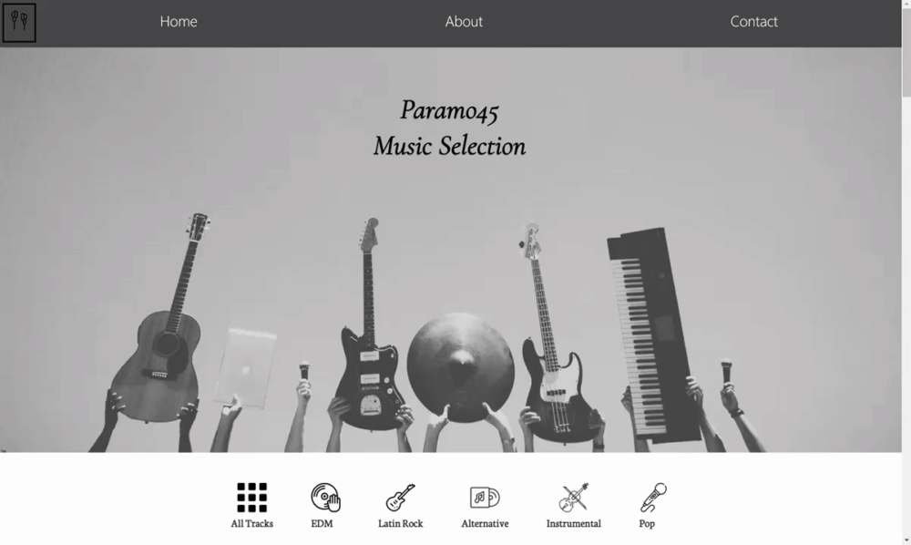
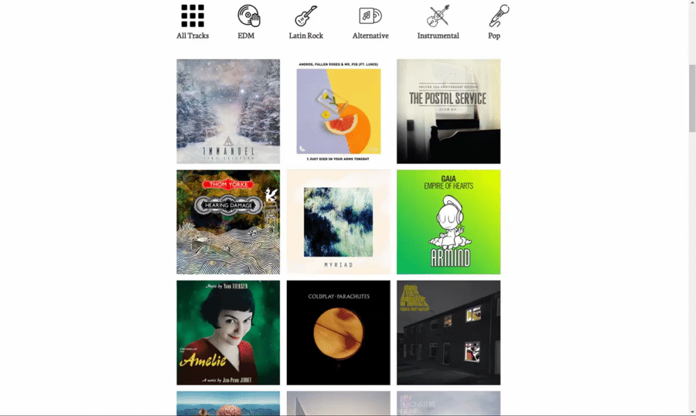
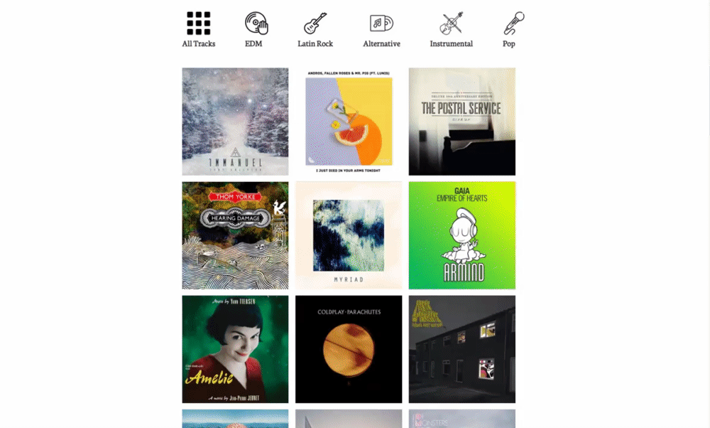

# Paramo45 Music Selection

Paramo45 Music Selection is web app that displays a collection of songs from 6 different genres. This app was build using vanilla JS, SCSS, HTML, firestore Database. Spotify's API was used to get the data for each track.

#### Main Page

 

#### Web Player for Each Track Preview

 

#### Different Music Genres

 

 #### Mobile Friendly
 

Link: [Paramo45 Music Selection](https://paramo45-music-selection.web.app/) 

## Licence

[MIT](https://choosealicense.com/licenses/mit/)

